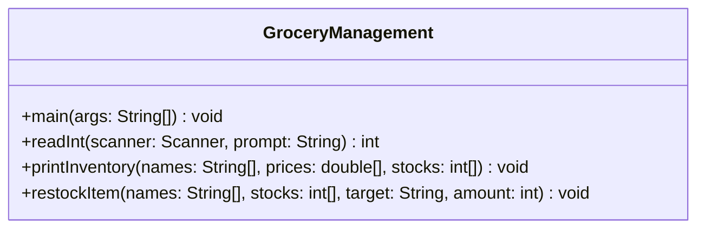

# Grocery Management System

**CS3354 – Assignment 1: Java Program and Collaboration**
Texas State University

A command-line grocery management system written in Java. It uses **parallel arrays** to store each item's name, price, and stock, where the same index in each array refers to the same item. The user can view the inventory, restock an item, or exit through a text menu.

---

## How It Works

The program models a small grocery inventory using **three parallel arrays** of size 10:

- `itemNames` (`String[]`) — the name of each item
- `itemPrices` (`double[]`) — the price of each item
- `itemStocks` (`int[]`) — the quantity in stock

The same index in all three arrays always refers to the same item (e.g. `itemNames[2]`, `itemPrices[2]`, and `itemStocks[2]` are Milk's name, price, and stock). Unused slots are left as `null` in `itemNames`, which the display logic uses to know which indices are empty.

`main` sets up the arrays with four starter items (Oranges, Apples, Milk, Lettuce) and then runs a loop that repeatedly:

1. Prints the menu (View / Restock / Exit).
2. Reads the choice with `readInt`, which keeps re-prompting until it gets a valid whole number instead of crashing on non-numeric input.
3. Dispatches to the matching method:
   - **1 (View)** — calls `printInventory`, which walks the arrays and prints every non-null item, counting and reporting empty slots.
   - **2 (Restock)** — reads an item name and an amount (validated with `readInt`, rejecting zero/negative amounts), then calls `restockItem`, which searches `itemNames` for a case-sensitive match and adds the amount to the matching index in `itemStocks`, or prints "Item not found." if there's no match.
   - **3 (Exit)** — prints a goodbye message and returns, ending the loop.

---

## Team Members & Contributions

| Member | Branch | Task | Method(s) |
|---|---|---|---|
| **Dang Nguyen** | `feature-menu` | Task 3 – User Menu | `main(String[] args)` |
| **Ella Farrell** | `feature-display` | Task 1 – Inventory Display | `printInventory(String[], double[], int[])` |
| **Hunter Norris** | `feature-restock` | Task 2 – Restock & Search | `restockItem(String[], int[], String, int)` |
| **Kalie Newman** | `cleanup` | Task 4 – Cleanup & Validation | `readInt(Scanner, String)` |
| **Brody Malcolm** | `code-enhancement` | Task 5 – Code-enhancement & Formatting | `printInventory(String[], double[], int[])` |


### Dang Nguyen – User Menu (`feature-menu`)
- Built the menu in `main` with a `Scanner` and a loop.
- Connected the menu to the other methods: **1** = View, **2** = Restock, **3** = Exit.
- Handled invalid menu input and the leftover newline after `nextInt()`.

### Ella Farrell – Inventory Display (`feature-display`)
- Wrote `printInventory`, which loops through the parallel arrays.
- Uses an `if-else` inside the loop so that only non-empty slots (`names[i] != null`) are printed.

### Hunter Norris – Restock & Search (`feature-restock`)
- Wrote `restockItem`, which searches for an item by name with `.equals()`.
- Adds the amount to the matching index in the stock array.
- Prints "Item not found." if the item is not in the inventory.

### Kalie Newman – Cleanup & Validation (`cleanup`)
- Added `readInt`, which loops until the user enters a valid whole number, so a non-numeric menu choice or restock amount re-prompts instead of crashing with `InputMismatchException`.
- Wired `readInt` into the menu choice and the restock amount, switched the item name prompt to `nextLine().trim()`, and rejected restock amounts that are zero or negative.
- Updated `printInventory` to use an `if-else` that also counts and reports empty inventory slots, and switched its output to `printf` formatting.
- Added a confirmation message after a successful restock and fixed comment/output typos (`sucessfully`, `variabklke`, `refrence`, `parrallel`).
- Fixed the missing `@param args` in `main`'s Javadoc, corrected Javadoc indentation, and regenerated `docs/` with author tags.
- Added a `.gitignore` for `.DS_Store` and compiled `.class` files.

### Brody Malcolm – Code-enhancement & Formatting (`code-enhancement`)
- Fixed formatting inconsistencies throughout codebase. 
- Implemented final integer variables MAX_ITEMS for integer arrays. 
- Implemented "low stock warnings" for when stock of an items is 2 or below.
- Changed `.equals()` in `restockItem` to `.equalsIgnoreCase` to read both upper and lower case. 

---

## Project Structure

```
.
├── GroceryManagement.java   # Source code
├── docs/                    # Generated Javadoc documentation
├── screenshots/             # Screenshots of the program running
└── README.md
```

---

## UML Class Diagram

The program is intentionally a single class (`GroceryManagement`) with static methods operating on parallel arrays, rather than an object-oriented design with a separate `Item` class — this matches the assignment's parallel-array requirement.



---

## How to Run

Requires Java (JDK 8 or later).

```bash
javac GroceryManagement.java
java GroceryManagement
```

### Sample Menu
```
--- Menu ---
1. View
2. Restock
3. Exit
Please enter your choice (1-3):
```

---

## Program Execution Screenshots

Screenshots demonstrating the program running successfully are in the [`screenshots/`](screenshots) folder:

| Screenshot | Demonstrates |
|---|---|
| [`01-menu-view-invalid-input.png`](screenshots/01-menu-view-invalid-input.png) | The menu, viewing the full inventory (with empty-slot count), and an invalid menu entry re-prompting instead of crashing |
| [`02-restock-item.png`](screenshots/02-restock-item.png) | Restocking an existing item (Milk, +10) with a confirmation message |
| [`03-restock-item-not-found.png`](screenshots/03-restock-item-not-found.png) | Attempting to restock an item that isn't in the inventory ("Item not found.") |

---

## Documentation

Javadoc is generated into the `docs/` folder with:

```bash
javadoc -d docs -author GroceryManagement.java
```

Open `docs/index.html` in a browser to view it.

---

## Git Workflow

1. Each member created their own feature branch from `main`.
2. Each member completed their task and committed on their branch.
3. Each branch was merged into `main`.

The commit history and branch merges in this repository show each member's individual contributions.
